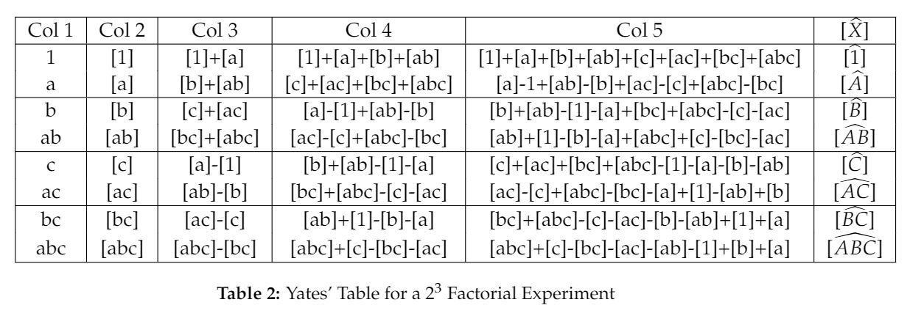
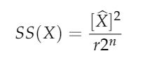

**Summary of the Package and its Working** 

The package `YatesAlgo.FactorialExp.SR` comprises of a function `run.yates.algo`, which takes in user inputs for the following, 

* `trt.combo` :: A factor type array, listing down the **Treatment Combinations** in a 2^n Factorial Experiment, in their standard order. For instance, if we are dealing with a 2^3 Factorial Experiment, i.e., there are 3 factors involved in the experiment, namely, factors **A**, **B** and **C**. The 8 treatment combinations listed in their standard order are `1,a,b,ab,c,ac,bc,abc`. Therefore the input should be as follows,

> trt.combo = c(1,a,b,ab,c,ac,bc,abc) # For a 2^3 Factorial Experiment.

* `trt.total` :: A numeric vector storing the **totals/sum** of each treatment combination involved in the design, i.e., in a 2^3 Factorial Experiment, the corresponding treatment totals are `[1],[a],[b],[ab],[c],[ac],[bc],[abc]`. Hence the input will be, 

> trt.total = c(...) # A Numeric Vector comprising of the corresponding Treatment Totals.

* `n` :: A numeric value indicating the number of **factors** involved in a 2^n Factorial Experiment. For instance, in a 2^3 Factorial Experiment, `n = 3`.

> n = 3 # For a 2^3 Factorial Experiment.

* `r` :: A numeric value signifying the number of **replicates** used for a **CRD**, or the number of **blocks** used in case of an **RBD**. Conducting a 2^3 Factorial experiment in 3 blocks using an RBD, would make `r=3`.

> r = 3 # Conducting 2^3 Factorial Experiment using an RBD with 3 blocks.

With these above mentioned inputs from the user, the function performs the Yates' Algorithm, in order to return a numeric vector comprising of the Sum of Squares of the (2^n) - 1 [`(2^3) - 1 = 7`] **Factorial Effects**, which are further utilized in the analysis of the design.

**The Yates' Algorithm**

The Algorithm was developed by **Frank Yates**. Let us consider a `2^n` Factorial Experiment, i.e., there are `n` respective factors involved in the experiment. Hence the total number of **treatment combinations** are `2^n` and the total number of **factorial effects** are `(2^n) - 1`.

The Algorithm comprises of the following steps.

* **Step 1** :: In the first column of the Yates' Table, list down all the possible `2^n` treatment combinations, in their respective **standard order**.

* **Step 2** :: In the second column of the Yates' Table, write down the treatment combination totals, starting from **[1]**, right till the end.

* **Step 3** :: In the third column of the Yates' Table, make the entries as described.
Divide the second column into **pairs** of consecutive treatment combination totals. Thereby putting in the **first half** of the third column, **sum of the consecutive pairs of treatment combinations**, and putting in the **second half** of the third column, **differences of the first element of every treatment combination total pair from its second element**.

* **Step 4** :: From columns `4` to `n+2` of the Yates' Table, repeat the process as discussed in Step 3, i.e., dividing the previous column into pairs of treatment combination totals, then inserting the sum of the consecutive pairs formed into the first half of the present column and inserting the differences of the first element from the second element of the pair formed, into the second half of the present column.

From the **second element** in the **last column** of the Yates' Table, we would obtain the numerator of the Sum of Squares' expression for the Factorial Effects, i.e., if we are dealing with a `2^3` Factorial Experiment, then the Yates' Table will look somewhat like this,

Therefore, the required **Sum of Squares of the Factorial Effects**, in a `2^n` Factorial Experiment, will then be given by,

{}
You can click the *Cite* button above, to enable import publication metadata into your reference management software, i.e., to make a citation of the above publication.
{}

